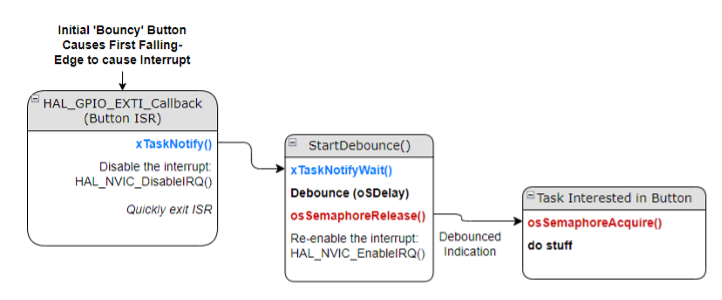
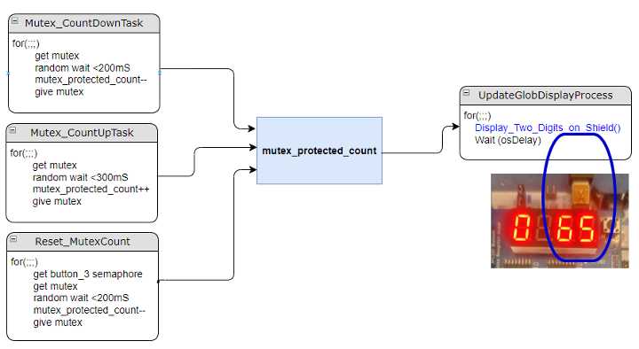
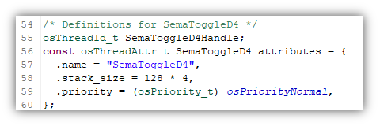

# NAME: \_\_\_\_\_\_\_\_\_\_\_\_\_\_\_\_\_\_\_\_\_\_\_\_\_\_\_\_\_\_\_\_\_\_\_

# Introduction and Objectives of the Lab

This lab shows how various independent tasks can communicate through the
RTOS-controlled signaling mechanisms. It also shows the good practice of
handling interrupts by using semaphores to signal their respective
tasks.

This lab will demonstrate the following Interprocess Communication
mechanisms:

1.  Semaphores and Task-Notifications

2.  Mutexes

3.  Protected Global Variables

4.  Process Notification via Software Timers

In the provided FreeRTOS system, tasks are set up to use these
mechanisms to communicate with each other. The mechanisms and associated
tasks (and assignments) are described in the respective sections of the
lab.
___
## Part 1: RTOS-friendly debounced buttons -- Notifications and Semaphores

As discussed in class, all mechanical buttons come with the mechanically
generated issue of 'bouncing' which can create multiple input requests
to a system where only a single entry is required. Methods to alleviate
this problem include external RC circuits on the button input,
dedicating a timer to the incoming button, and software counting loops
to debounce the input. Note that the 'bounce' characteristics of the
switch may vary, but in general they are much less than a human response
time. Typically, a debounce time on the order of 10 -30 milliseconds is
long enough to get rid of the mechanical flaw and not miss a human
reaction time.

In an RTOS environment, the timeout necessary to debug a switch should
not come within the ISR servicing the button event. Leaving the RTOS to
'wait' for a debounce inside of the ISR is bad practice as it can be
blocking. One simple solution is to use notification mechanisms in the
RTOS and trigger them from within the ISR. Two such mechanisms are
'**Semaphores'** and '**Task-Notifications'**. **Semaphores** can be
binary or counting and can track numbers of events from multiple
sources. Task-Notifications are simply a signal from one process to
another.

By using a signaling mechanism this way, we create a 'Thread-safe'
interrupt service routine. This means that the ISR will not create
unexpected behavior in a multi-process environment and supports scalable
grow with more/less processes. It's 'safe' to threads.

For a task(s) waiting for a clean, debounced button event, the initial
button press can't trigger the task(s), it must first trigger the
debounce wait, that then starts the task(s):

### Part 1 Instructions and Questions (2 pts)

>**Create a Task** 
(Either use the GUI -- *Under Middleware/FreeRTOS* or manually in the code) that will toggle LED_D4 each time Button_1 is pressed.  
 
<mark>1. How did your task ‘wait’ for the debounced button?  
_______________________________________________________ </mark>
    
<mark>2.)	How long is the time between the button interrupt coming in and it being enabled again?  
_______________________________________________________ </mark>
> 
 

>**Modify Task to be Safe** 
You’re given the framework of a second task (Semaphore_Toggle_D3) -- 

>3. Modify this so that it that also waits for the same Button_1_Semaphore.  It should then toggle LED_D3 each time Button_1 is pressed.  Note that they both have been created with the same Priority.. 
<mark>
[x] Yes, I modified and got it working and tested it by 
>_________________________________________________________________________________  
[ ] No, I didn't do this because  _______________________________________________________ </mark>
> 
> 

 
4.)	Do both of (D4 and D3) toggle with a single button press?  Describe the behavior?  

[mark]    _______________________________________________________ [mark]

5.)	Now change one of the priorities of these two tasks and re-run.  How has the behavior changed?

    _______________________________________________________

___
## Part 2: Mutexes

Mutex's are used in embedded systems to guarantee exclusive access to a
resource that more than one process may need to use. Examples include
hardware devices or shared memory locations that could be requested
simultaneously.

For the hardware set of our labs, we have only a single 4-digit
seven-segment display. If there were multiple producers trying to change
the value of this display, one way to guarantee its integrity would be
to protect it with a mutex: only one process at a time gets to send
output to it.

For this example, the following picture shows how a mutex could protect
a value being display on the seven-segment:

The three processes on the right are all competing for access to write
to the protected variable. The **mutex_protected_count** is continuously
updated to the seven-segment display on the right. The CountDown and
CountUp are both trying at random intervals, and the Reset_MutexCount
waits for the Button_3 (via its associated semaphore), then resets the
current count.

### Part 2 Instructions and Questions (2 pt)

##  Part 3: Software Timers

In a previous lab, we learned how to setup any of the hardware timer
blocks to generate periodic interrupts. This is limited by the number of
actual timers available on the silicon, and still requires careful
coding to insure RTOS-friendly servicing, as discussed with the buttons
above. Software timers are easy to deploy, flexible to use, and have no
concerns operating in the RTOS environment.

Software timers don't generate an interrupt, they simply execute a
procedure when they expire.

Button_2 is used to toggle the SW_Timer_7Seg between running/stopped.
When the timer expires, it calls a routine to decrement the left-most
display digit.

## EXTRA CREDIT Ideas
